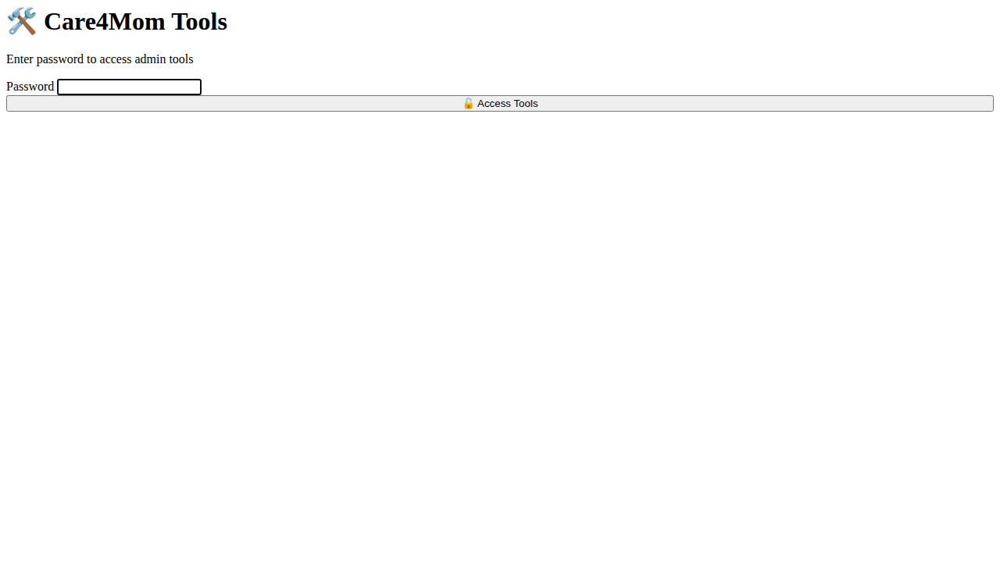
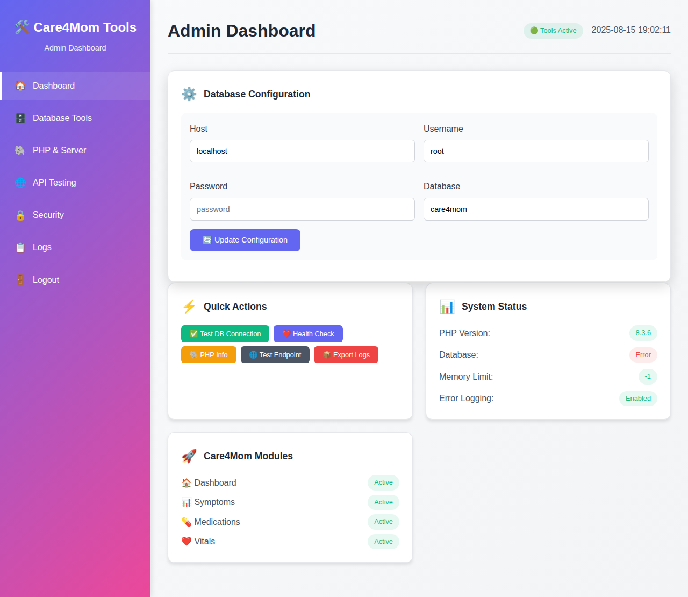
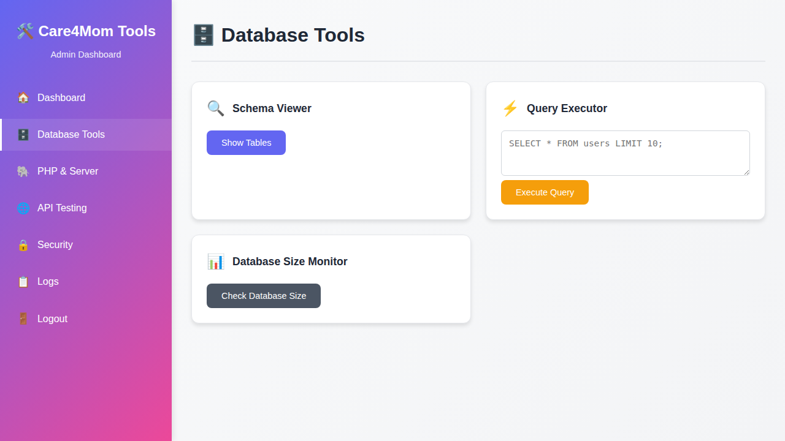

# Care4Mom Admin Tools Dashboard

## Overview
The TOOLS.php file provides a comprehensive administrative dashboard specifically designed for the Care4Mom cancer care tracking application. This tool offers database management, server monitoring, API testing, and security validation capabilities.

## Access
- **File Location**: `/TOOLS.php` (root directory)
- **Password**: `079777`
- **URL**: `http://your-domain.com/TOOLS.php`

## Features

### 🔐 Security
- Password-protected access with session management
- Logout functionality
- Safe SQL query execution (SELECT-only)
- SQL injection testing (safe mode)

### 🗄️ Database Tools
- **Connection Checker**: Test database connectivity with custom credentials
- **Query Executor**: Run SELECT queries safely
- **Schema Viewer**: Display table structure and record counts
- **Size Monitor**: Track database growth and storage usage
- **Health Check**: Verify Care4Mom table integrity

### 🐘 PHP & Server Tools
- **PHP Information**: Complete system information display
- **Function Tests**: Verify critical PHP functions availability
- **Memory Monitoring**: Track memory usage and limits
- **Error Logging**: Check error reporting configuration
- **Extension Status**: View loaded PHP extensions

### 🌐 API Testing Tools
- **Request Simulator**: Test GET/POST/PUT/DELETE requests
- **Endpoint Checker**: Validate Care4Mom specific endpoints
- **Response Monitor**: Track response times and status codes
- **Authentication Testing**: Verify token and session handling

### 🔒 Security Tools
- **SQL Injection Test**: Safe vulnerability scanning
- **Session Inspector**: View active session information
- **CSRF Testing**: Cross-site request forgery validation
- **Security Status**: Overall security health check

### 📋 Logs & Monitoring
- **Error Logs**: View recent error entries
- **Activity Logs**: Track user actions and system events
- **Query Logs**: Monitor database query execution
- **Export Logs**: Download system logs as files

### ⚡ Quick Actions
- Test DB Connection
- Run Health Check
- View PHP Info
- Test Endpoints
- Export Logs

## Usage

### Initial Setup
1. Place `TOOLS.php` in the root directory of Care4Mom
2. Ensure `logs/` directory exists and is writable
3. Access via web browser: `http://your-domain.com/TOOLS.php`
4. Enter password: `079777`

### Database Configuration
The dashboard allows manual database credential entry:
- **Host**: Database server hostname (default: localhost)
- **Username**: Database username (default: root)
- **Password**: Database password (default: empty)
- **Database**: Database name (default: care4mom)

### Navigation
Use the sidebar to navigate between tool sections:
- 🏠 Dashboard - Main overview and quick actions
- 🗄️ Database Tools - SQL management and monitoring
- 🐘 PHP & Server - Server configuration and status
- 🌐 API Testing - Endpoint and request testing
- 🔒 Security - Security scanning and validation
- 📋 Logs - Log viewing and export

## Care4Mom Integration

### Specific Features
- **Care4Mom Table Monitoring**: Tracks users, symptoms, medications, vitals tables
- **Endpoint Testing**: Tests dashboard.php, symptom.php, med.php, login.php
- **Health Checks**: Validates application-specific functionality
- **Error Integration**: Works with Care4Mom error logging system

### Compatibility
- Designed for Care4Mom application architecture
- Uses existing database configuration patterns
- Integrates with Care4Mom styling and accessibility features
- Supports elderly user interface requirements

## Technical Specifications

### Requirements
- PHP 8.3+
- MySQL/MariaDB database
- Web server (Apache/Nginx or PHP built-in server)
- Write permissions for logs directory

### Security Features
- Session-based authentication
- SQL injection protection via prepared statements
- XSS protection with input sanitization
- Safe query execution (SELECT-only mode)
- CSRF token validation ready

### Performance
- Lightweight single-file implementation
- AJAX-powered interface for responsive updates
- Minimal database impact with efficient queries
- Mobile-responsive design

## Screenshots

### Login Interface

### Main Dashboard

### Database Tools

## Troubleshooting

### Common Issues
1. **Database Connection Failed**
   - Verify database credentials in configuration widget
   - Check if MySQL service is running
   - Ensure database exists and user has permissions

2. **Permission Denied**
   - Check web server write permissions for logs directory
   - Verify PHP execution permissions

3. **Session Issues**
   - Ensure session directory is writable
   - Check PHP session configuration

### Support
For issues specific to Care4Mom integration, refer to the main application documentation or contact the Care4Mom development team.

## Development Notes

### File Structure
- **Authentication**: Password check and session management
- **Dashboard**: Main interface with widgets
- **Tool Functions**: Database, PHP, API, security utilities
- **AJAX Handlers**: JSON responses for dynamic updates
- **UI Components**: Responsive CSS and JavaScript

### Extension
The tool is designed to be easily extensible:
- Add new tool functions in the appropriate section
- Create new navigation items in the sidebar
- Implement AJAX handlers for dynamic functionality
- Follow existing naming conventions and patterns

## Version
- Version: 1.0
- Lines of Code: 1,434
- Created: 2025
- Compatible with: Care4Mom v1.0+